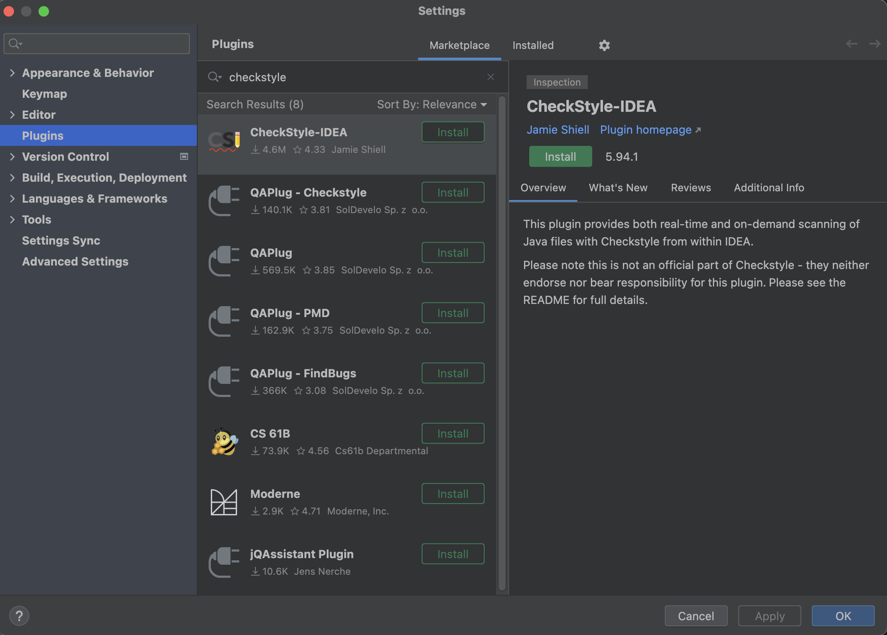
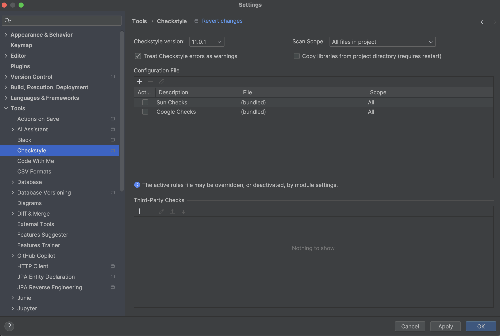
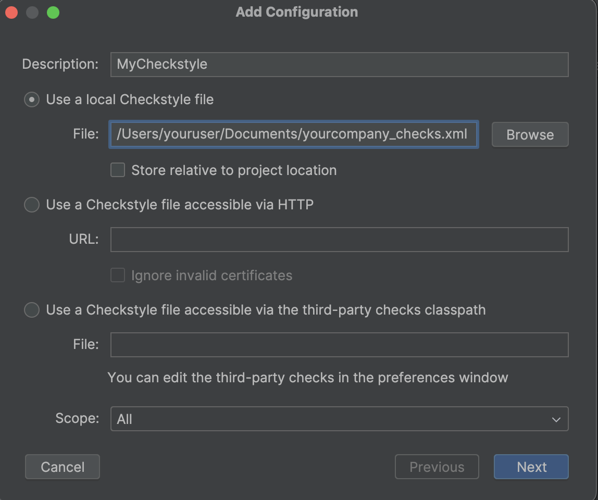
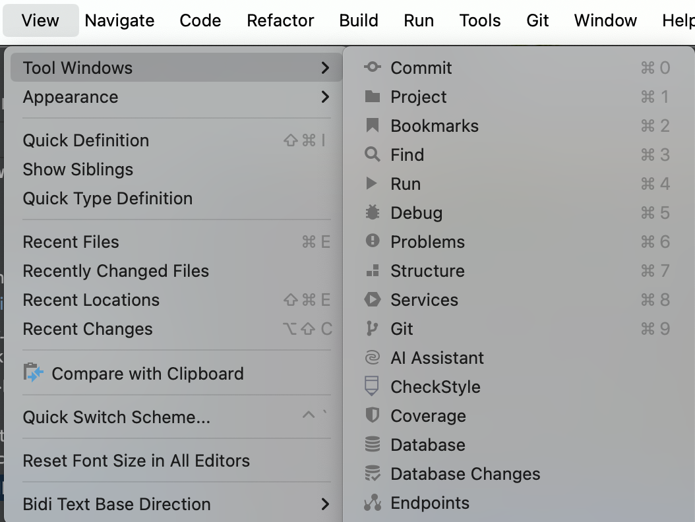
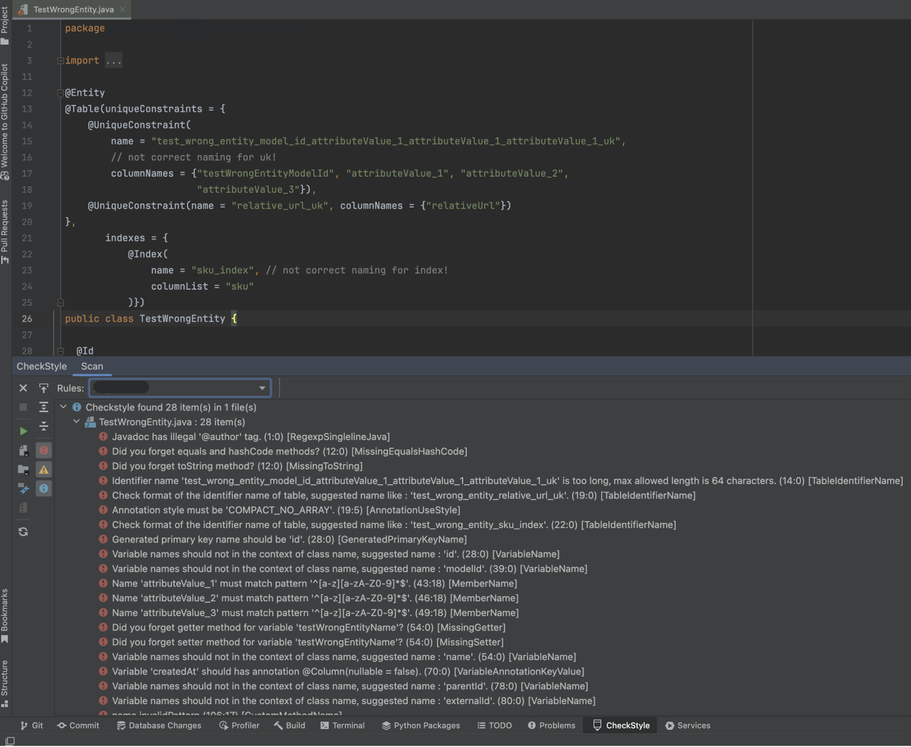

# Editor Support IntelliJ Idea Checkstyle Plugin

## Install Checkstyle-IDEA Plugin

1. Open IDE Settings: `IntelliJ IDEA -> Settings -> Plugins` and search "checkstyle" on Marketplace.
   
2. Choose [**CheckStyle-IDEA plugin**](https://plugins.jetbrains.com/plugin/1065-checkstyle-idea) and click "Install".
3. Restart IntelliJ IDEA after installation.

---

## Configure CheckStyle-IDEA Settings

1. Open CheckStyle-IDEA Settings: `IntelliJ IDEA -> Settings -> Tools -> Checkstyle`.
2. Add **Yourcompany checkstyle jar file** (`yourcompany-checks-X.X.X.jar`) to Third-Party checks.
    - You can download the latest Yourcompany Checkstyle jar on Nexus or other platform.
    - Jar included in `com.yourcompany.checkstyle.yourcompany-checks` package.
      
3. Add `yourcompany_checks.xml` as configuration file:
    - Add description and choose Configuration file.
    - You can use option **'Use a local Checkstyle file'** by giving `yourcompany_checks.xml` file.
      
4. Click **Next** and check that validation is OK.
5. Click **Apply** and **OK**.

**Note:** You can use the Checkstyle plugin in IntelliJ IDEA to view Checkstyle problems directly in the UI. Remember to
update the JAR and XML files with each new release.

---

## Scan File, Module, or Project

1. Show Checkstyle plugin on sidebar: `View -> Tool Windows -> CheckStyle`.
   
2. Open a file and run checkstyle from sidebar for:
    - That file
    - The module of that file
    - The entire project

**Important:** Don't forget to select **Yourcompany** as active configuration on the Rules section.

---

## Configure Inspections

Please follow the provided instructions in
the [Codestyle IntelliJ IDEA Integration](../codestyle/codestyle-intellij-idea-installation.md) for codestyle and
inspection settings.
