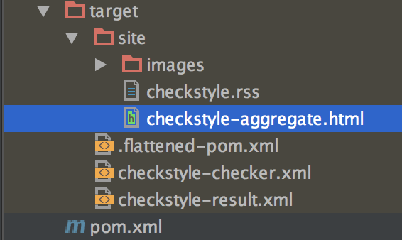

# Maven Checkstyle Plugin

The current approach of **Parent Project** is providing all necessary configurations. Since the beginning version of
**Parent Project** projects will include **checkstyle configuration by default**. This means every Maven build will
require checkstyle checks. Builds that do not pass checkstyle check will fail.

---

## Skipping in Local Builds

In order to skip checkstyle check in local builds, add the following parameter:

```
mvn clean install -Dcheckstyle.skip=true
```

---

## Suppressions

If you want to exclude specific packages or classes, then add Maven properties for each module like:

```
<checkstyle.excludes>**/x/y/generated/GeneratedClass.java, **/generated/**</checkstyle.excludes>
```

---

## Execution

To run only the checkstyle plugin:

```
mvn checkstyle:check
```

To run checkstyle as a profile:

```
mvn clean install -Pcheckstyle
```

---

# How to Use Maven Checkstyle Plugin

This section includes extra information for custom configurations in some **non-Parent Project** based projects.

---

## Configuration

To use it, configure your **maven-checkstyle-plugin** like so:

Define checkstyle properties on `pom.xml` and change them with your own values:

```xml

<properties>
  <!--checkstyle-->
  <yourcompany-checkstyle.version>${YOUR_YOURCOMPANY_CHECKSTYLE_VERSION}</yourcompany-checkstyle.version>
  <checkstyle.version>${YOUR_CHECKSTYLE_VERSION}</checkstyle.version>
  <maven-checkstyle-plugin.version>${YOUR_MAVEN_CHECKSTYLE_VERSION}</maven-checkstyle-plugin.version>
  <checkstyle.configLocation>/com/yourcompany/checkstyle/yourcompany_checks.xml</checkstyle.configLocation>
  <checkstyle.excludes>${YOUR_CHECKSTYLE_EXCLUDES}</checkstyle.excludes>
</properties>
```

If you want to check checkstyle on builds:

```xml

<build>
  <plugins>
    <!--checkstyle plugin-->
    <plugin>
      <groupId>org.apache.maven.plugins</groupId>
      <artifactId>maven-checkstyle-plugin</artifactId>
      <version>${maven-checkstyle-plugin.version}</version>
      <dependencies>
        <dependency>
          <groupId>com.yourcompany.checkstyle</groupId>
          <artifactId>yourcompany-checks</artifactId>
          <version>${yourcompany-checkstyle.version}</version>
        </dependency>
        <dependency>
          <groupId>com.puppycrawl.tools</groupId>
          <artifactId>checkstyle</artifactId>
          <version>${checkstyle.version}</version>
        </dependency>
      </dependencies>
      <configuration>
        <configLocation>${checkstyle.configLocation}</configLocation>
        <failOnViolation>true</failOnViolation>
        <violationSeverity>warning</violationSeverity>
        <includeTestSourceDirectory>true</includeTestSourceDirectory>
        <excludes>${checkstyle.excludes}</excludes>
        <outputFile>${project.build.directory}/checkstyle-result.xml</outputFile>
        <outputFileFormat>xml</outputFileFormat>
      </configuration>
      <executions>
        <execution>
          <id>validate</id>
          <phase>validate</phase>
          <goals>
            <goal>check</goal>
          </goals>
        </execution>
        <execution>
          <id>aggregate</id>
          <phase>verify</phase>
          <goals>
            <goal>checkstyle-aggregate</goal>
          </goals>
        </execution>
      </executions>
    </plugin>
  </plugins>
</build>
```

---

## Using as a Profile

```xml

<profiles>
  <profile>
    <id>checkstyle</id>
    <build>
      <plugins>
        <!--checkstyle plugin-->
        <plugin>
          <groupId>org.apache.maven.plugins</groupId>
          <artifactId>maven-checkstyle-plugin</artifactId>
          <version>${maven-checkstyle-plugin.version}</version>
          <dependencies>
            <dependency>
              <groupId>com.yourcompany.checkstyle</groupId>
              <artifactId>yourcompany-checks</artifactId>
              <version>${yourcompany-checkstyle.version}</version>
            </dependency>
            <dependency>
              <groupId>com.puppycrawl.tools</groupId>
              <artifactId>checkstyle</artifactId>
              <version>${checkstyle.version}</version>
            </dependency>
          </dependencies>
          <configuration>
            <configLocation>${checkstyle.configLocation}</configLocation>
            <failOnViolation>true</failOnViolation>
            <violationSeverity>warning</violationSeverity>
            <includeTestSourceDirectory>true</includeTestSourceDirectory>
            <excludes>${checkstyle.excludes}</excludes>
            <outputFile>${project.build.directory}/checkstyle-result.xml</outputFile>
            <outputFileFormat>xml</outputFileFormat>
          </configuration>
          <executions>
            <execution>
              <id>validate</id>
              <phase>validate</phase>
              <goals>
                <goal>check</goal>
              </goals>
            </execution>
            <execution>
              <id>aggregate</id>
              <phase>verify</phase>
              <goals>
                <goal>checkstyle-aggregate</goal>
              </goals>
            </execution>
          </executions>
        </plugin>
      </plugins>
    </build>
  </profile>
</profiles>
```

See the [maven-checkstyle-plugin documentation](https://maven.apache.org/plugins/maven-checkstyle-plugin/) for more
information about what the configuration settings mean.

Internally, we have the above configuration in the `<pluginManagement/>` section of a **company-wide parent POM**,  
meaning that projects only need to specify the below in their `<build><plugins>` section:

```
<plugin>
  <artifactId>maven-checkstyle-plugin</artifactId>
</plugin>
```

---

## Result

To see the checkstyle results after a Maven run, check the result file:

```
target/site/checkstyle-aggregate.html
```


