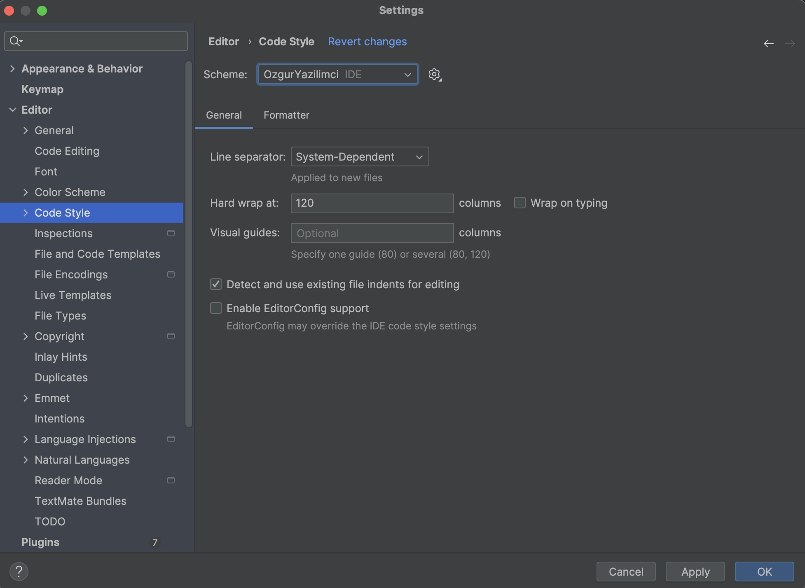
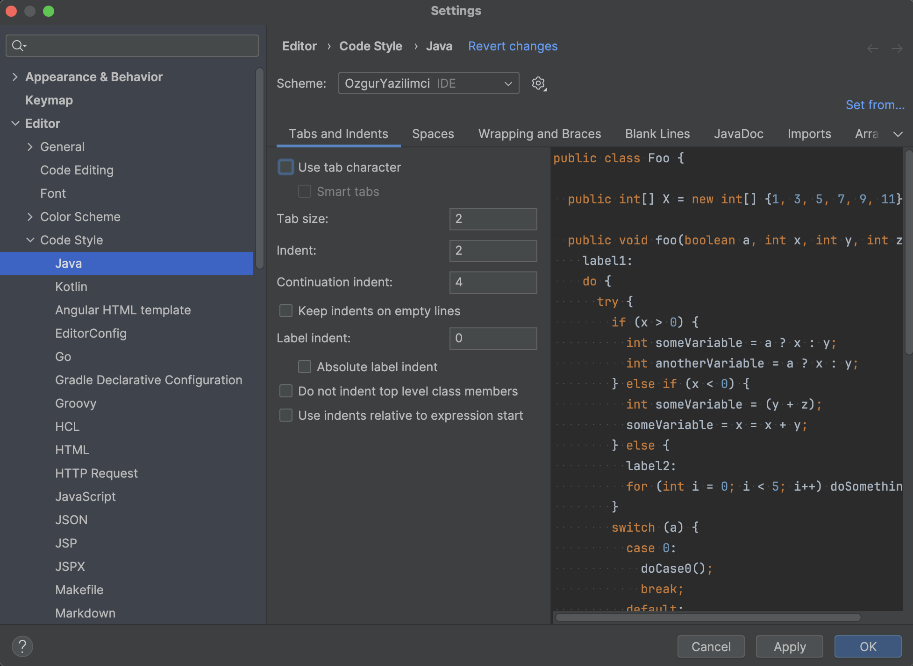
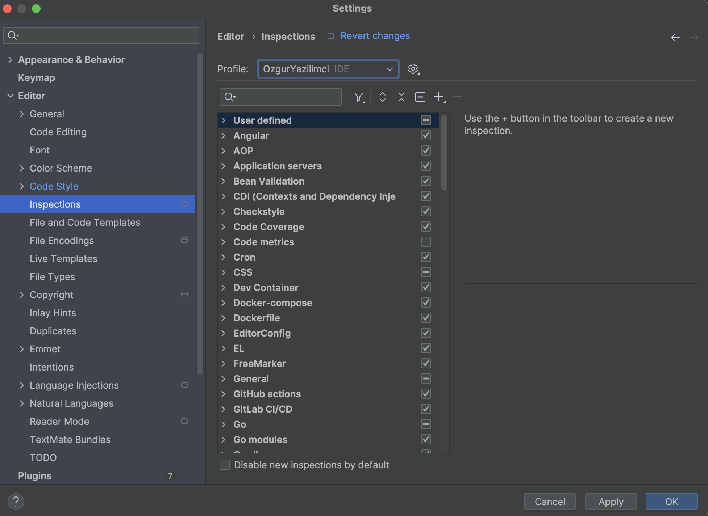
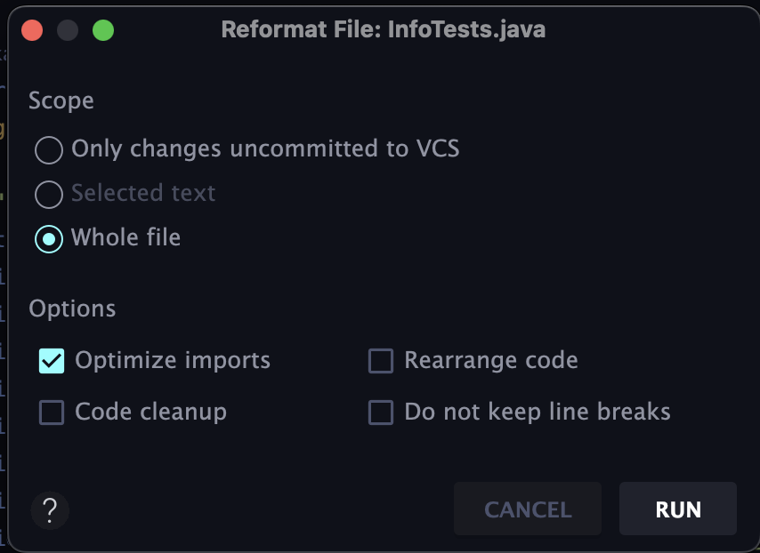

# Codestyle IntelliJ IDEA Installation

Codestyle is a feature in IntelliJ IDEA that helps developers follow consistent formatting rules.  
It improves readability, enhances teamwork, and reduces errors by enforcing a standard style across projects.

**OzgurYazilimci Codestyle Integration** is based
on [OzgurYazilimci Codestyle GitHub Project](https://github.com/ozgurryazilimci/ozguryazilimci-codestyle).  
This includes IntelliJ IDEA code style settings for OzgurYazilimci's Java projects.

---

## Installation

1. Clone OzgurYazilimci’s codestyle GitHub project that includes code style settings.
2. On Unix, run the `install.sh` script.  
   On Windows, use `install.bat` instead.
3. Restart IntelliJ if it's running.
4. Open IntelliJ Project Settings -> **Editor -> Code Style** and select **OzgurYazilimci** as schema.
   
5. Configure code style settings.
   
6. Open IntelliJ Project Settings -> **Editor -> Inspections** and select **OzgurYazilimci** as profile.
   

---

## Wiki

For further reading, please visit
the [GitHub wiki page](https://github.com/ozgurryazilimci/ozguryazilimci-codestyle/wiki).

---

## Problem: Import Issue

**Import Problem**

If formatting code with `CMD + Option + L` does not reorder imports alphabetically, your settings may be broken.

### Solution

Use `SHIFT + CMD + Option + L`.  
In the popup that appears, ensure **Optimize imports** is checked.  
Then reformat again — imports should now be sorted alphabetically.

